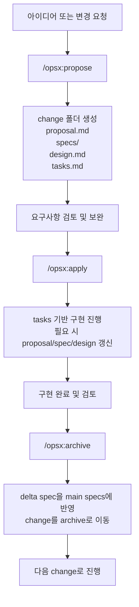

# OpenSpec 사용 방법 및 시작 가이드 (2026-04-06)

## 질문
OpenSpec은 어떻게 시작하고, 실제로 어떤 순서로 사용하면 되는가?

## 답변 요약
OpenSpec은 AI 코딩 어시스턴트에게 바로 코드를 맡기기 전에, 변경 의도와 요구사항을 proposal/specs/design/tasks 같은 artifact로 먼저 정리하게 만드는 spec-driven workflow다. 가장 빠른 시작 경로는 `npm install -g @fission-ai/openspec@latest`로 설치한 뒤 프로젝트에서 `openspec init`을 실행하고, AI에게 `/opsx:propose <하고 싶은 일>`을 말하는 것이다. 이후에는 `/opsx:apply`로 구현을 진행하고, 검토가 끝나면 `/opsx:archive`로 delta spec을 메인 spec에 반영한다. 핵심은 “대화”가 아니라 “파일로 남는 change artifact”를 중심으로 일한다는 점이다.

## 핵심 포인트
- 시작 3단계: 설치 → `openspec init` → `/opsx:propose`
- 기본 흐름: `propose → apply → archive`
- 산출물 중심: proposal, delta specs, design, tasks를 남긴다.
- source of truth는 `openspec/specs/`, 작업 중인 변경은 `openspec/changes/`에 둔다.
- OpenSpec은 rigid한 프로세스보다 iterative한 정렬 장치에 가깝다.

## 근거
- [[Fission-AI - OpenSpec: Spec-driven development (SDD) for AI coding assistants (GitHub repo)]]
- [[Fission-AI - Getting Started (OpenSpec docs, 2026-04-06)]]
- [[OpenSpec]]
- [[Agentic Workflow]]

## 흐름 다이어그램



## 세부 내용
### 1. OpenSpec이 하는 일
OpenSpec은 “무엇을 만들지”를 먼저 합의하게 한다. 즉 AI에게 구현부터 시키는 대신, change 단위 폴더를 만들고 그 안에 proposal, specs, design, tasks를 정리하게 만들어 요구사항과 구현 흐름을 분리한다.

이 방식이 좋은 이유는 다음과 같다.
- 요구사항이 채팅창에만 남지 않는다.
- 구현 중간에 방향이 바뀌어도 artifact를 업데이트하면서 추적할 수 있다.
- 나중에 왜 이렇게 만들었는지 회고하기 쉽다.
- 다른 모델이나 다른 세션으로 넘어가도 문맥을 파일로 이어받을 수 있다.

### 2. 가장 빠른 시작 방법
#### 설치
```bash
npm install -g @fission-ai/openspec@latest
```

#### 프로젝트 초기화
```bash
cd your-project
openspec init
```

#### 첫 change 시작
AI에게 이렇게 말하면 된다.
```text
/opsx:propose add-dark-mode
```
또는
```text
/opsx:propose 사용자별 대시보드 필터 저장 기능 추가
```

그러면 보통 다음 구조가 생긴다.
```text
openspec/
├── specs/
├── changes/
│   └── <change-name>/
│       ├── proposal.md
│       ├── design.md
│       ├── tasks.md
│       └── specs/
└── config.yaml
```

### 3. 기본 사용 흐름
#### `/opsx:propose`
새 change를 정의하는 시작점이다.
- 왜 이 작업을 하는지
- 무엇이 바뀌는지
- 어떤 요구사항이 추가/수정/삭제되는지
- 구현 전에 생각해야 할 기술적 접근이 무엇인지
를 먼저 문서로 만든다.

보통 이 단계의 결과물:
- `proposal.md`
- `specs/<domain>/spec.md`
- `design.md`
- `tasks.md`

#### `/opsx:apply`
정리된 task를 바탕으로 실제 구현을 진행한다.
이때 중요한 점은 구현 중 발견한 사실이 있으면 artifact를 먼저 수정하고 계속 갈 수 있다는 것이다. OpenSpec은 waterfall처럼 앞단 문서를 닫아버리는 방식이 아니라, 구현 중 학습한 내용을 다시 proposal/spec/design에 반영하는 흐름을 허용한다.

#### `/opsx:archive`
change가 끝나면 archive한다.
이때 delta spec의 내용이 메인 `openspec/specs/`에 반영된다.
- ADDED: 메인 spec에 추가
- MODIFIED: 기존 spec을 대체
- REMOVED: 메인 spec에서 제거

즉 archive는 단순 보관이 아니라 “현재 시스템의 canonical spec을 업데이트하는 단계”다.

### 4. Delta spec을 어떻게 이해하면 좋은가
OpenSpec의 핵심은 delta spec이다. delta spec은 “지금 시스템에서 무엇이 달라지는가”를 표현한다.

대표 섹션은 세 가지다.
- ADDED Requirements
- MODIFIED Requirements
- REMOVED Requirements

예를 들어 dark mode를 추가한다면:
- ADDED: 다크모드 토글 요구사항 추가
- MODIFIED: 기존 UI theme 정책 수정
- REMOVED: 더 이상 쓰지 않는 오래된 테마 옵션 삭제

이 구조 덕분에 현재 spec과 변경 의도를 분리해서 관리할 수 있다.

### 5. 각 artifact를 어떻게 보면 되는가
#### proposal.md
왜 이 change를 하는지 정리한다.
- 문제 배경
- 목표
- 범위
- 비범위

#### specs/
요구사항 자체를 적는다.
- 시스템이 반드시 해야 하는 일
- 사용자 시나리오
- 성공 조건

#### design.md
기술적 접근을 적는다.
- 어떤 구조로 구현할지
- 트레이드오프
- 선택한 이유
- 의존성이나 마이그레이션 포인트

#### tasks.md
실행 체크리스트다.
- 무엇부터 구현할지
- 어떤 단위로 검증할지
- 완료 여부를 어떻게 볼지

실무적으로는 tasks.md가 “에이전트 실행용 체크리스트”, specs는 “합의용 문서”, design은 “기술 선택 기록” 역할을 한다.

### 6. 처음 시작할 때 추천하는 사용법
OpenSpec을 처음 쓸 때는 너무 큰 기능보다 작은 change 하나로 감을 잡는 게 좋다.

추천 예시:
- 다크모드 추가
- 사용자 설정 저장
- 검색 필터 추가
- 로그인 에러 메시지 개선
- 배치 작업 결과 CSV 다운로드 추가

좋은 첫 change의 조건:
- 범위가 작다.
- 결과가 눈에 보인다.
- 요구사항 추가/수정이 명확하다.
- `proposal → apply → archive` 한 사이클을 끝내보기 좋다.

### 7. expanded workflow는 언제 쓰나
기본 프로필은 빠르게 쓰기 좋다.
- `/opsx:propose`
- `/opsx:apply`
- `/opsx:archive`

더 세분화된 흐름이 필요하면 profile을 바꿔 expanded workflow를 쓸 수 있다.
예:
- `/opsx:new`
- `/opsx:continue`
- `/opsx:ff`
- `/opsx:verify`
- `/opsx:sync`
- `/opsx:bulk-archive`
- `/opsx:onboard`

이건 팀 협업, 긴 change, 검증 단계 분리, 여러 change 동시 운영 같은 상황에서 더 유용하다.

### 8. OpenSpec을 쓸 때 기억할 운영 팁
- 구현 전에 먼저 propose를 한다.
- 채팅으로만 합의하지 말고 artifact를 남긴다.
- 구현하다 바뀐 점은 문서부터 고친다.
- archive를 해야 source of truth가 갱신된다.
- change 이름은 검색하기 쉽게 짓는다.
- 작은 단위로 change를 쪼개는 편이 archive와 회고가 쉽다.

### 9. 한 줄 운영 감각
OpenSpec은 “AI에게 일을 맡기는 방법”이라기보다, “AI와 일을 할 때 변경을 문서화하고 정렬하는 방법”에 더 가깝다. 즉 실행 엔진 자체라기보다 실행 전에 명세를 맞추는 layer라고 이해하면 가장 자연스럽다.

## 적용
- 개인 프로젝트에서는 기능 추가 전에 spec을 짧게라도 남기는 습관으로 쓸 수 있다.
- 팀 프로젝트에서는 change 단위 합의 문서와 구현 체크리스트로 쓸 수 있다.
- 여러 AI 도구를 번갈아 쓰는 환경에서는 문맥 이전 비용을 줄이는 장치로 유용하다.

## 다음 액션
- OpenSpec을 쓸 실제 프로젝트 하나를 정해서 첫 `propose`를 만들어본다.
- 자주 만드는 change 유형(예: UI 개선, API 변경, 리팩터링)에 맞춘 proposal/spec/tasks 패턴을 정리한다.
- 필요하면 expanded workflow까지 켜서 verify 단계를 포함한 운영으로 확장한다.

## 후속 질문
- OpenSpec을 내 개인 프로젝트 워크플로에 어떻게 맞추면 좋을까?
- proposal/spec/design/tasks를 한국어로 써도 괜찮을까?
- OpenSpec과 Spec Kit/Kiro는 실제 운영 감각에서 어떻게 다를까?

## Related
- [[Outputs Index]]
- [[Knowledge Map]]
- [[OpenSpec]]
- [[Agentic Workflow]]
