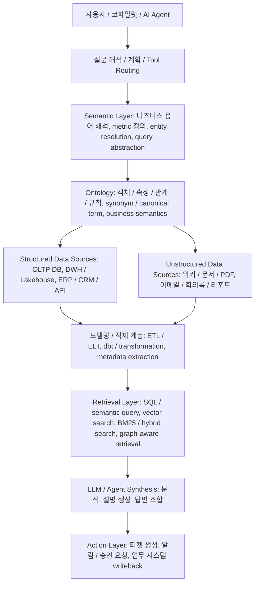

# 온톨로지 vs 지식그래프 vs 시맨틱 레이어 - AX 관점 실무 정리 (2026-04-08)

## 질문
온톨로지, 지식그래프, 시맨틱 레이어의 차이를 헷갈리지 않게 정리하고, 회사에서 AX를 하려면 온톨로지를 어떻게 설계 시작해야 하는지, 그리고 Palantir Ontology를 기준으로는 어떻게 이해하면 좋은지 설명해달라는 요청.

## 답변 요약
온톨로지는 조직 세계를 구성하는 개념·속성·관계·규칙을 정의하는 의미 모델이다. 지식그래프는 그 모델을 따라 실제 엔티티와 관계를 연결한 데이터 네트워크다. 시맨틱 레이어는 이 의미 구조를 사용자와 AI가 비즈니스 언어로 질의하고 활용할 수 있게 해주는 해석·접근 계층이다. AX에서는 AI가 데이터에 단순 접근하는 것을 넘어 의미 있게 이해하고 추론해야 하므로, 온톨로지와 시맨틱 레이어가 중요한 기반이 된다. Palantir Ontology는 여기에 action layer까지 더해 읽기뿐 아니라 운영 실행까지 연결하는 operational abstraction으로 이해하면 좋다.

## 핵심 포인트
- 온톨로지 = 개념 정의를 담당하는 의미 모델
- 지식그래프 = 그 의미 모델을 따라 실제 데이터들을 연결한 네트워크
- 시맨틱 레이어 = 그 의미를 비즈니스 언어와 질의 인터페이스로 노출하는 계층
- 온톨로지는 보통 시스템 전체라기보다 모델에 가깝고, 시맨틱 레이어는 그 모델을 실제 활용 가능하게 만드는 해석 계층에 가깝다.
- AX에서는 “데이터 접근”보다 “데이터 해석 품질”이 더 중요하다.
- 좋은 온톨로지는 전사 대통합보다, 한 업무 시나리오에서 작고 질문 중심으로 시작하는 편이 낫다.
- Palantir Ontology는 object/property/link/action을 통해 운영 모델까지 끌어올린다는 점이 특징이다.

## 비교 표
| 구분         | 온톨로지                       | 지식그래프                      | 시맨틱 레이어                  |
| ---------- | -------------------------- | -------------------------- | ------------------------ |
| 핵심 역할      | 의미 체계 정의                   | 실제 엔티티와 관계 저장/연결           | 데이터를 비즈니스 언어로 해석해 제공     |
| 질문         | “무엇이 무엇인가?”                | “무엇이 누구와 어떻게 연결되는가?”       | “사용자/AI가 이걸 어떻게 쉽게 쓰는가?” |
| 초점         | 개념, 속성, 관계, 규칙             | 실제 데이터 인스턴스의 연결망           | 질의, 지표, 용어, 추상화          |
| 형태         | 모델/스키마/설계도                 | 그래프 데이터                    | 접근 계층/해석 계층              |
| 예시         | 고객, 주문, 제품, 공장, 계약의 정의와 관계 | 김민수 고객 → 주문123 생성 → 제품A 포함 | “VIP 고객의 최근 30일 주문 금액”   |
| 주 사용자      | 도메인 설계자, 데이터 아키텍트          | 데이터 플랫폼, 검색/추천/추론 시스템      | 분석가, 비즈니스 사용자, AI 코파일럿   |
| 없으면 생기는 문제 | 용어와 개념이 팀마다 다름             | 관계 탐색/연결 추론이 약함            | 자연어 질의와 지표 해석이 불안정함      |

## 근거
- simula - 데이터의 미로 속에서 의미를 찾는 열쇠: 팔란티어 온톨로지의 시맨틱 레이어 탐구 (Article, 2025-04-23)
- SKAI Worldwide - [1부] AI 전환에 온톨로지(ontology)가 필요한 이유 (Article, 2025-04-29)
- Databricks - 시맨틱 레이어란 무엇인가요? (Article, 2025-05-28)
- Ontology

## 세부 내용
### 1. Ontology와 Semantic Layer의 정의를 더 정확히 잡기
Ontology는 어떤 도메인에 무엇이 존재하고, 각 대상이 어떤 속성을 가지며, 서로 어떤 관계와 규칙을 가지는지를 정의하는 의미 모델이다. 즉 시스템 전체라기보다 “개념과 관계를 정의하는 설계도”에 가깝다.

Semantic Layer는 그 의미 모델을 바탕으로, 원시 데이터 구조를 비즈니스 친화적인 용어와 지표, 질의 방식으로 노출하는 해석 계층이다. 즉 “정의된 의미를 실제 사용자가 쓰게 만드는 인터페이스”에 가깝다.

짧게 정리하면:
- Ontology = 의미의 설계도
- Semantic Layer = 의미의 인터페이스

중요한 점은 Semantic Layer가 언제나 Ontology라는 시스템 안의 하위 레이어로만 존재하는 것은 아니라는 것이다. 일반론에서는 Ontology가 의미 모델이고, Semantic Layer는 그 모델을 활용 가능하게 만드는 계층으로 보는 편이 더 정확하다. 다만 Palantir처럼 Ontology를 넓은 operational model로 다루는 제품 문맥에서는 Ontology가 더 상위 시스템처럼 보이고 semantic layer 기능을 내부에 포함하는 것처럼 느껴질 수 있다.

### 2. 셋의 관계를 한 문장으로
- 온톨로지: 우리 조직 세계를 어떤 개념과 관계로 볼지 정의하는 모델
- 지식그래프: 그 모델을 실제 데이터 인스턴스로 연결한 그래프
- 시맨틱 레이어: 그 의미 구조를 사람과 AI가 비즈니스 언어로 사용하게 만드는 층

비유하면:
- 온톨로지 = 도시 설계도
- 지식그래프 = 실제 도시의 도로망/건물 연결 정보
- 시맨틱 레이어 = 내비게이션 앱

### 3. 실제 예시로 보기
이커머스 회사 기준으로 보면:

온톨로지
- Customer
- Order
- Product
- Shipment
- 관계: 고객이 주문을 생성하고, 주문은 상품을 포함하며, 주문은 배송으로 이어진다.

지식그래프
- 고객 김민수
- 주문 O-1024
- 상품 P-77
- 배송 S-88
- 연결: 김민수 → O-1024 생성 → P-77 포함 → S-88 배송됨

시맨틱 레이어
- “지난달 VIP 고객 주문 총액 보여줘”
- “배송 지연이 많은 고객군 보여줘”
- “재구매율 높은 상품 카테고리 알려줘”

여기서 시맨틱 레이어는 VIP 정의, 주문 총액 계산 규칙, 배송 지연 기준 같은 비즈니스 정의를 해석한다.

### 3. AX에서 왜 필요한가
AX에서 중요한 것은 AI가 데이터를 “볼 수 있느냐”보다 “의미 있게 이해하느냐”다.

온톨로지와 시맨틱 레이어가 필요한 이유:
- 같은 개념을 여러 팀이 다른 용어로 부르는 문제를 통일한다.
- 객체 사이 관계를 통해 단순 조회가 아니라 맥락 기반 질의가 가능해진다.
- 자연어 질의 시 “매출”, “VIP”, “활성 고객” 같은 표현을 조직 공통 정의로 해석할 수 있다.
- 설명 가능한 AI를 만들기 쉬워진다. 왜 이 고객이 위험군인지, 왜 이 주문이 이상한지 구조적으로 말할 수 있다.
- 보안/거버넌스 관점에서 민감정보, 재무정보, 개인정보 같은 범주를 의미 기반으로 관리하기 쉽다.

결국 AX에서는 모델 성능만으로는 부족하고, AI가 조직의 현실 세계를 오해하지 않게 하는 의미 계층이 필요하다.

### 4. 아키텍처 관점에서 보면 어떻게 배치되나
핵심은 Ontology와 Semantic Layer가 기존 DB를 대체하는 저장소가 아니라, DB와 문서 소스 위에 올라가는 “의미 해석 계층”이라는 점이다. 구조적으로는 보통 아래처럼 쌓인다.

- 원천 데이터 계층: OLTP DB, DWH/Lakehouse, ERP/CRM API, 문서 저장소
- 모델링/적재 계층: ETL·ELT, dbt 모델, 문서 파싱, 메타데이터 추출
- Ontology 계층: 객체·속성·관계·규칙·동의어·비즈니스 의미 정의
- Semantic Layer 계층: metric 정의, entity resolution, business-friendly query abstraction
- Retrieval 계층: vector search, keyword search, hybrid retrieval, graph-aware retrieval
- LLM/Agent 계층: query planning, tool routing, synthesis, explanation, action planning
- Action 계층: 티켓 생성, 워크플로 트리거, 승인 요청, 업무 시스템 writeback

즉 RAG는 이 구조 안에서 “문맥을 회수하는 계층”이고, Ontology와 Semantic Layer는 “무엇을 어떤 의미로 봐야 하는지”를 정리하는 기반층이라고 보면 된다.

### 5. Mermaid Architecture Diagram

### 6. 질문 하나가 처리되는 흐름 예시
예를 들어 사용자가 “배송 지연이 늘어난 VIP 고객군의 원인이 뭐야?”라고 물으면 시스템은 대략 이렇게 동작한다.

1. 질문에서 VIP 고객, 배송 지연, 원인 분석이라는 의도를 분리한다.
2. Ontology를 통해 VIP 고객, 배송, 주문, 창고, 공급업체가 어떤 개념과 관계인지 확인한다.
3. Semantic Layer를 통해 delayed_shipment_rate, VIP customer segment, net revenue 같은 metric과 entity 기준을 해석한다.
4. Structured query로 고객-주문-배송-공급망 데이터를 조회한다.
5. RAG로 운영 공지, 장애 보고서, 담당자 메모 같은 비정형 문서를 회수한다.
6. LLM/Agent가 structured facts와 retrieved docs를 종합해 원인을 설명한다.
7. 필요하면 action layer에서 담당자 티켓이나 알림을 생성한다.

즉 기존 DB만 있을 때는 “저장과 조회” 중심이지만, Ontology + Semantic Layer + RAG가 붙은 구조에서는 “의미 해석 + 구조화된 관계 탐색 + 비정형 문맥 회수 + 추론 + 실행”까지 이어진다.

### 7. 최소 구현 버전은 어떻게 시작하나
처음부터 거대한 graph platform이 필요한 것은 아니다. 현실적으로는 다음처럼 얇게 시작할 수 있다.

- 기존 DB / DWH 유지
- 핵심 개념 사전(entity dictionary) 작성
- 용어 alias 사전(term alias) 작성
- metric SQL view 또는 dbt metric layer 작성
- 문서용 RAG 구축
- LLM이 raw schema 대신 semantic entity / metric catalog를 먼저 보게 만들기

이 정도만 있어도 얇은 ontology + semantic layer + retrieval 구조가 만들어지고, AX use case를 꽤 안정적으로 실험할 수 있다.

### 8. 회사에서 AX 하려면 온톨로지를 어떻게 시작하나
처음부터 전사 전체를 만들려고 하면 실패하기 쉽다. 작은 업무 플로우에서 시작하는 편이 좋다.

권장 흐름:
1. AI가 풀어야 할 질문부터 정한다.
   - 예: 고객 이탈 위험 분석, 생산 불량 원인 탐색, 계약 리스크 탐지, 영업 코파일럿
2. 질문에 필요한 핵심 엔티티를 5~12개 정도 뽑는다.
   - 예: 고객, 주문, 상품, 상담, 환불
3. 각 엔티티의 속성과 관계를 정리한다.
   - 고객이 주문을 생성한다, 주문은 상품을 포함한다 같은 관계를 우선 명확히 한다.
4. 용어를 통일한다.
   - 고객/회원/user/account, 매출/결제액/순매출 같은 용어의 canonical term을 정한다.
5. 데이터 소스에 매핑한다.
   - CRM.customers, ERP.client_master, billing.transactions처럼 실제 테이블과 연결한다.
6. 시맨틱 레이어로 노출한다.
   - 고객 생애가치, 재구매율, VIP 고객, 배송 지연률 같은 지표와 질의 인터페이스를 만든다.
7. AI use case에 연결한다.
   - 자연어 질의, RAG, agent 탐색, 리스크 탐지, 설명 가능한 답변 생성으로 연결한다.

### 9. 좋은 온톨로지 설계 원칙
- 작게 시작한다.
- 질문 중심으로 설계한다.
- 객체보다 관계를 중요하게 본다.
- 용어 정의를 먼저 합의한다.
- 완벽한 모델보다 살아있는 운영 자산으로 유지한다.

### 10. Palantir Ontology를 기준으로 이해하기
Palantir가 말하는 Ontology는 단순 데이터 카탈로그나 메타데이터 관리가 아니다. 핵심은 “조직의 운영 세계를 데이터 위에 재구성하는 operational model”에 가깝다.

핵심 구성:
- Objects: Customer, Supplier, Aircraft, Patient, Machine, Order, Shipment 같은 업무 객체
- Properties: 객체의 속성
- Links: 객체들 사이의 관계
- Actions: 객체에 대해 실행 가능한 행동

특히 Actions가 중요하다. 일반적인 semantic layer가 읽기/해석 중심이라면, Palantir Ontology는 주문 상태 변경, 재고 보충 요청, 설비 점검 티켓 생성 같은 운영 행동까지 연결한다. 그래서 “알려주는 AI”를 넘어 “업무를 움직이는 AI”로 확장되기 쉽다.

### 11. Palantir Ontology가 강하게 느껴지는 이유
- 데이터 해석과 운영 모델이 같이 있다.
- 관계 중심 탐색이 강하다.
- 액션 연결이 가능하다.
- 디지털 트윈처럼 조직 운영 상태를 객체/관계로 재현하는 느낌이 강하다.

이 때문에 제조, 공급망, 헬스케어, 국방처럼 복잡한 관계와 운영 상태를 다뤄야 하는 분야에서 특히 매력적이다.

## 적용
이 내용을 AX 관점에서 실제로 적용하려면 다음 질문으로 좁히는 것이 좋다.
- 우리가 AI에게 가장 먼저 맡기고 싶은 업무 질문은 무엇인가?
- 그 질문에 답하려면 어떤 객체와 관계를 알아야 하는가?
- 지금 회사 안에서 가장 자주 엇갈리는 용어 정의는 무엇인가?
- 자연어 질의나 AI 코파일럿을 붙였을 때 가장 먼저 semantic layer로 노출할 지표는 무엇인가?

## 다음 액션
- 영업/CRM 시나리오 기준 ontology 샘플 설계
- 제조/공장 시나리오 기준 ontology 샘플 설계
- Palantir Ontology vs Databricks semantic layer 비교표 정리
- AX 준비용 핵심 객체/관계/지표 워크시트 만들기

## 후속 질문
- 온톨로지 없이 semantic layer만 있어도 되는가?
- RAG와 ontology는 무엇이 다른가?
- 우리 조직에서 가장 먼저 정의해야 할 canonical term은 무엇인가?
- Palantir Ontology는 일반 BI semantic layer와 어디서 갈라지는가?

## Related
- Ontology
- Knowledge Map
- simula - 데이터의 미로 속에서 의미를 찾는 열쇠: 팔란티어 온톨로지의 시맨틱 레이어 탐구 (Article, 2025-04-23)
- [[SKAI Worldwide - [1부] AI 전환에 온톨로지(ontology)가 필요한 이유 (Article, 2025-04-29)]]
- Databricks - 시맨틱 레이어란 무엇인가요? (Article, 2025-05-28)
- Outputs Index
